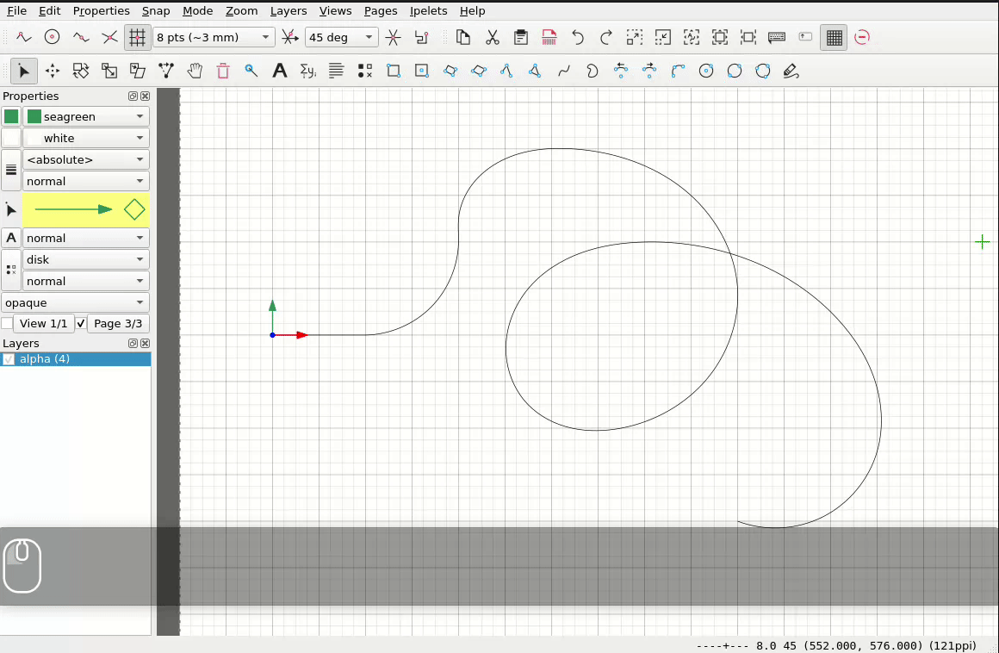
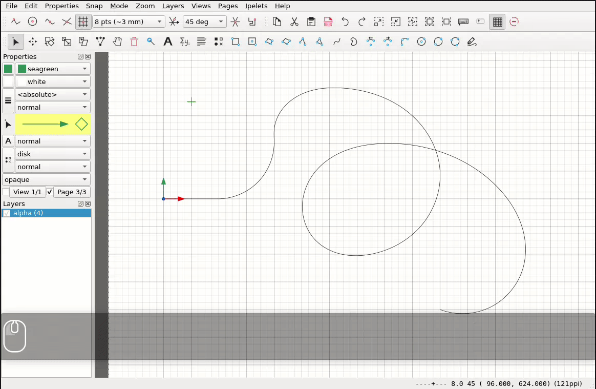

# Copy Tools Ipelet

This Ipelet implements 3 tools to create different types of patterns in [Ipe](https://ipe.otfried.org/):

## Linear patterns

### Demo

### Usage

* Select objects to be copied (all types are allowed, including nested groups of objects)
* Select `Ipelets->Copy Tools->Linear/Grid Pattern`
* Move the two endpoints of the "displacement vector"
* Specify the number of instances:
    * use number keys `0`-`9` or
    * use `j` or `k` to increment or decrement the number or
    * input the exact number by right clicking and selecting "Set number of total instances"
* To apply the pattern press `space` or right right click and select "Accept"

## Circular pattern

### Demo

### Usage

* Select objects to be copied (all types are allowed, including nested groups of objects)
* Set the origin of the current axis system (see [Ipe manual](https://otfried.github.io/ipe/40_snapping.html#angular-snapping))
* Select `Ipelets->Copy Tools->Circular Pattern`
* Specify the number of instances:
    * use number keys `0`-`9` or
    * use `j` or `k` to increment or decrement the number or
    * input the exact number by right clicking and selecting "Set number of total instances"
* If desired, the current axis system can be reset at any time (see video)
* The instances can either be distributed automatically over 360° or a fixed angle can be set between the instances by right clicking and selecting "Set fixed angle between instances"
* To apply the pattern press `space` or right right click and select "Accept"

## Patterns along paths

### Demo: Distribute along Path

### Demo: Copy along Path with fixed distances

### Usage

* Select objects to be copied (all types are allowed, including nested groups of objects)
* Select path along which you want to copy as primary selection (last selection made).
Any contiguous path consisting of a combination of line segments, circular arcs or different types of splines is allowed.
* Select `Ipelets->Copy Tools->Pattern along Path`
* Specify the number of instances:
    * use number keys `0`-`9` or
    * use `j` or `k` to increment or decrement the number or
    * input the exact number by right clicking and selecting "Set number of total instances"
* If desired, the orientation of the instances can either be fixed or it can be aligned with the tangent of the path by selection in the context menu
* The instances can either be distributed automatically along the path or a fixed distance can be set between the instances by right clicking and selecting "Set fixed distance between instances"
* To apply the pattern press `space` or right right click and select "Accept"

## Technical Details & Lessons Learned

* The implementation of linear and circular patterns was relatively straight forward
* For patterns along a path, each type of subpath (line segment, spline, circular arcs) has to be treated differently
* Since there is no closed form solution for the arc length of a Bezier spline, the arc length of each Bezier subpath has been computed with a lookup table
* The computed LUTs have also been used to place the objects at specific waypoints by interpolating between LUT entries (see https://pomax.github.io/bezierinfo/#tracing)
* The arc length of a circle can easily be calculated. For the arc length of an ellipse, however, an [elliptic integral](https://en.wikipedia.org/wiki/Elliptic_integral#Incomplete_elliptic_integral_of_the_second_kind) must be solved. Since it is also extremely difficult to get from a non-uniformly transformed circular arc to the ellipse equation in Ipe, all circular arcs were simply approximated as splines in a preprocessing step (see https://pomax.github.io/bezierinfo/#circles_cubic). For this purpose, the circular arc was transformed into the unit circle by using its inverse (nested) transformation matrix, approximated as a spline and transformed back again.
* The tangent of a waypoint is very easy to calculate. It is used for the orientation of the copied instances.

Synergies with my [lassotool](https://github.com/Marian-Braendle/ipe-lassotool/tree/main):

* For nested groups of objects, the transformation matrices have to be applied recursively
* The outline of an image object is not directly accessible. One option is to apply the inverse transformation matrix, get the bounding box and again apply the forward transformation.
* The outline of a text object is not directly accessible. One option is to calculate the outline based on the position, dimensions, alignment and transformation matrix